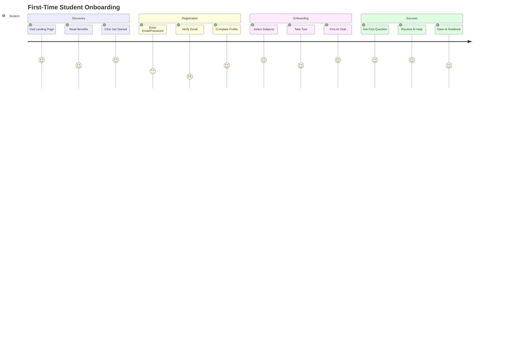
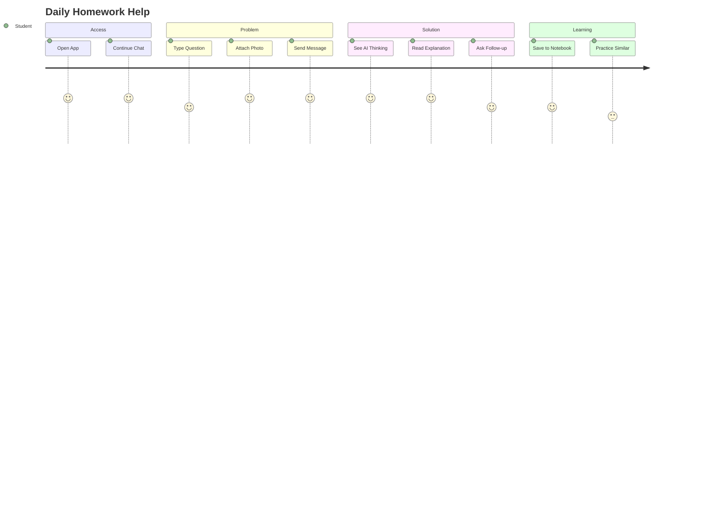
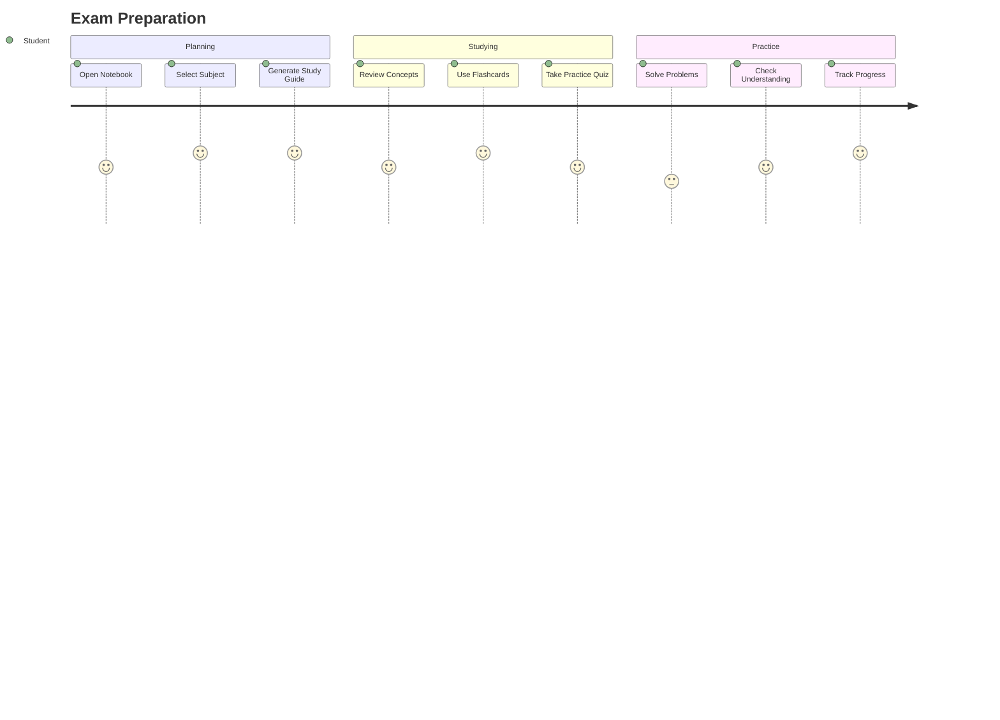
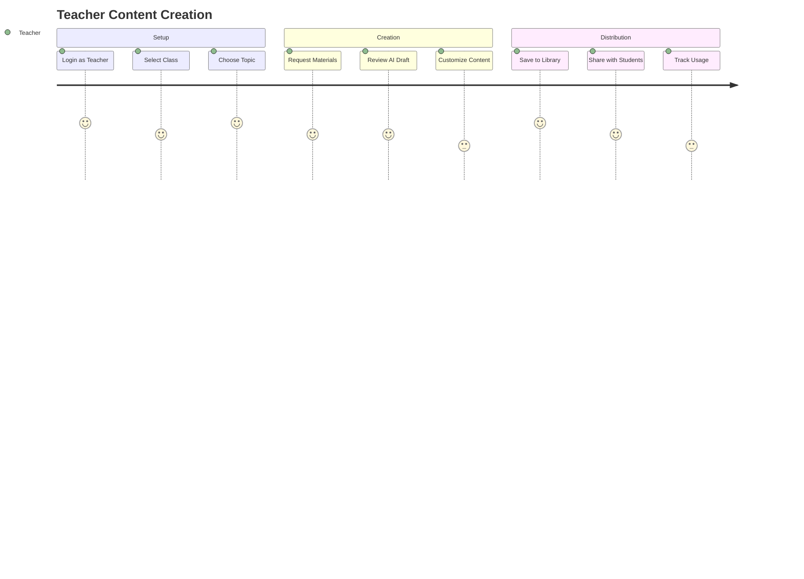
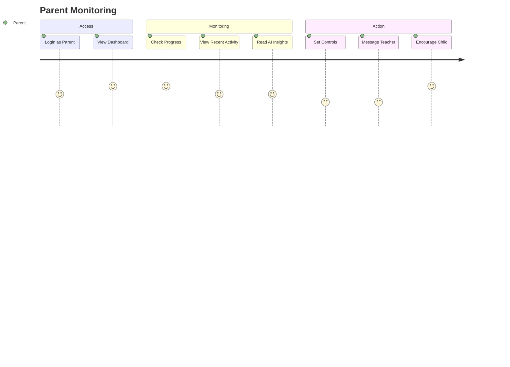

# Skooledin AI - User Journeys

## 👤 Student Journeys

### Journey 1: First-Time Student Onboarding
**Goal**: Get started with AI tutoring quickly

**Steps**:
1. **Landing** → See hero "Get instant homework help"
2. **Sign Up** → Quick registration with email/Google
3. **Profile Setup** → Name, grade level, subjects
4. **Welcome Tour** → 3-step interactive guide
5. **First Chat** → Pre-filled example question
6. **Success** → AI provides helpful answer
7. **Next Action** → Prompt to save or ask another

**Pain Points**:
- Long registration forms
- Unclear value proposition
- Complex onboarding

**Solutions**:
- Minimal signup (just email)
- Clear benefit messaging
- Interactive tour with real AI

### Journey 2: Daily Homework Help
**Goal**: Get help with specific homework problem

**Steps**:
1. **Quick Access** → App opens to chat
2. **Context** → Auto-detects subject from history
3. **Input Problem** → Type or photo of homework
4. **AI Response** → Step-by-step explanation
5. **Understanding** → Visual thinking process
6. **Follow-up** → Clarifying questions
7. **Save** → Add to notebook for review

**Optimizations**:
- Remember last subject
- Quick camera access
- Clear explanation formatting
- One-tap save to notebook

### Journey 3: Exam Preparation
**Goal**: Prepare effectively for upcoming test

**Steps**:
1. **Notebook** → View saved materials
2. **AI Assistant** → "Help me study for..."
3. **Study Guide** → AI generates from notes
4. **Flashcards** → Key concepts to memorize
5. **Practice Quiz** → Test understanding
6. **Weak Areas** → AI identifies gaps
7. **Focused Review** → Target weak spots

**Features Used**:
- Smart notebook organization
- AI study guide generation
- Spaced repetition flashcards
- Adaptive practice quizzes

## 👨‍🏫 Teacher Journeys

### Journey 4: Content Creation
**Goal**: Create supplementary materials for class

**Steps**:
1. **Teacher Dashboard** → Class overview
2. **Content Tools** → "Create materials"
3. **AI Assistant** → Describe needs
4. **Generated Content** → Worksheets, guides
5. **Customization** → Edit and brand
6. **Distribution** → Share link/code
7. **Analytics** → See student usage

**Value Props**:
- Save hours on prep
- Curriculum-aligned content
- Easy customization
- Usage tracking

### Journey 5: Student Progress Monitoring
**Goal**: Track and support struggling students

**Steps**:
1. **Class Dashboard** → Overview of all students
2. **Alerts** → "3 students struggling with..."
3. **Deep Dive** → Individual student view
4. **AI Insights** → Specific challenges identified
5. **Interventions** → Suggested actions
6. **Communication** → Message student/parent
7. **Follow-up** → Track improvement

## 👪 Parent Journeys

### Journey 6: Child Progress Monitoring
**Goal**: Stay informed about child's learning

**Steps**:
1. **Parent Portal** → Child overview
2. **Progress Summary** → Weekly report
3. **Recent Activity** → Topics studied
4. **AI Insights** → Strengths/challenges
5. **Controls** → Set study time limits
6. **Communication** → Contact teacher
7. **Engagement** → Encourage child

**Key Features**:
- Non-intrusive monitoring
- Actionable insights
- Privacy controls
- Communication tools

## 🎯 Cross-Journey Patterns

### Common Success Factors
1. **Instant Value** - Show benefit within 30 seconds
2. **Low Friction** - Minimal steps to goal
3. **Clear Progress** - Visual feedback throughout
4. **Next Actions** - Always suggest what's next
5. **Personalization** - Remember preferences

### Common Drop-off Points
1. **Registration** - Too many fields
2. **Onboarding** - Too long or unclear
3. **First Value** - Takes too long
4. **Complexity** - Feature overload
5. **Technical Issues** - Slow loading, errors

### Mobile-Specific Considerations
- **One-Handed Use** - Thumb-friendly navigation
- **Quick Access** - Critical features within reach
- **Offline Mode** - Clear indicators and functionality
- **Interruptions** - Save state automatically
- **Context Switching** - Easy app switching

## 📊 Journey Metrics

### Success Metrics
- **Onboarding Completion**: >80%
- **Time to First Value**: <2 minutes
- **Daily Active Return**: >60%
- **Feature Discovery**: >70%
- **Task Completion**: >85%

### Engagement Metrics
- **Session Length**: 15-20 minutes
- **Messages per Session**: 5-10
- **Notebooks Created**: 3+ per week
- **Study Tools Used**: 2+ per week
- **Return Frequency**: 5+ days/week

## 🔄 Continuous Improvement

### User Feedback Loops
1. **In-App Ratings** - After key actions
2. **Micro-Surveys** - Single question polls
3. **Usage Analytics** - Behavior tracking
4. **Support Tickets** - Pain point identification
5. **User Interviews** - Deep insights

### Iteration Process
1. Identify friction points
2. A/B test improvements
3. Measure impact
4. Roll out winners
5. Document learnings

### Future Journey Enhancements
- **Predictive Assistance** - Anticipate needs
- **Social Learning** - Peer collaboration
- **Gamification** - Achievement system
- **Voice-First** - Hands-free studying
- **AR Integration** - Visual learning

---

These user journeys guide our product decisions, ensuring every feature serves a real user need and every interaction moves users closer to their goals.